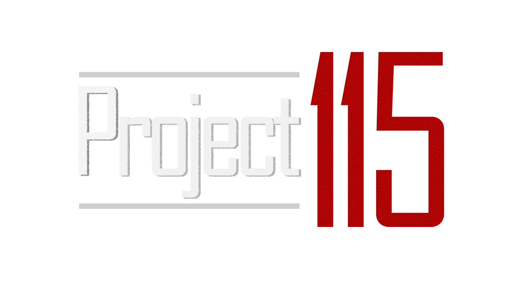

  
## Play Now
https://varunparbhakar.github.io/Project-115/
### About
A 2D top down clone of Call of Duty Zombies in HTML & JavaScript featuring a reimagine of BO2 Town, WaW and BO1 guns, custom made music and scuffed voice acting.  
### Trailer

## Credits
### TCSS 491 A - Blue 5 
- Varun Parbhakar: Coding, Textures, Mapping, Voice Acting 
- David Huynh: Coding, Music, Textures, Mapping, Voice Acting  
  - OST: https://soundcloud.com/david-huynh-136271687/sets/project-115-ost
- Yacine Bennour: Coding, Mapping, UX Designer  
### Other
- Chris Marriott: Empty Javascript Game Engine https://github.com/algorithm0r/Empty--GameEngine
- Treyarch: CoD Zombies, WaW Gun Sounds, BO1 Gun Sounds, Perk Music
  - https://steamcommunity.com/sharedfiles/filedetails/?id=948510972
  - https://steamcommunity.com/sharedfiles/filedetails/?id=1832129908
- Deepnight Games: RPG Map Maker 2 https://deepnight.net/tools/rpg-map/#:~:text=RPG%20Map%20is%20a%20tabletop,Forum
- Im-Not-Crying: Gun pixel spritesheet https://www.deviantart.com/im-not-crying/art/Nazi-Zombies-Weapons-and-Power-Ups-346007584
- Im-Not-Crying: Hud elements spritesheet https://www.deviantart.com/im-not-crying/art/Nazi-Zombies-HUD-Elements-346013662
- rileygombart: Player spritesheets https://opengameart.org/content/animated-top-down-survivor-player
- rileygombart: Zombie spritesheets https://opengameart.org/content/animated-top-down-zombie
### Known Issues
- For Edge Users, you can hide the double left click popup menu in that same menu.
- Firefox runs extremely poorly with constant lag spikes. It might be how Audio objects are created for each sound. We don't have a fix.
